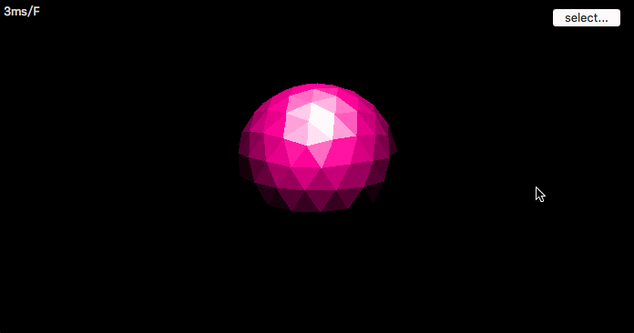

# 一个简单的软件光栅渲染器

***

### 2016-05-18新增

***

### 仿金属材质的渲染


### 2016-05-16

***

目前实现了局部坐标->世界坐标->屏幕投影坐标变换，透视纹理映射，w缓冲，伪灯光





# LICENSE

***

###WTFPL License

```
           DO WHAT THE FUCK YOU WANT TO PUBLIC LICENSE

Everyone is permitted to copy and distribute verbatim or modified
copies of this license document, and changing it is allowed as long
as the name is changed.

           DO WHAT THE FUCK YOU WANT TO PUBLIC LICENSE
  TERMS AND CONDITIONS FOR COPYING, DISTRIBUTION AND MODIFICATION

 0. You just DO WHAT THE FUCK YOU WANT TO.
```

